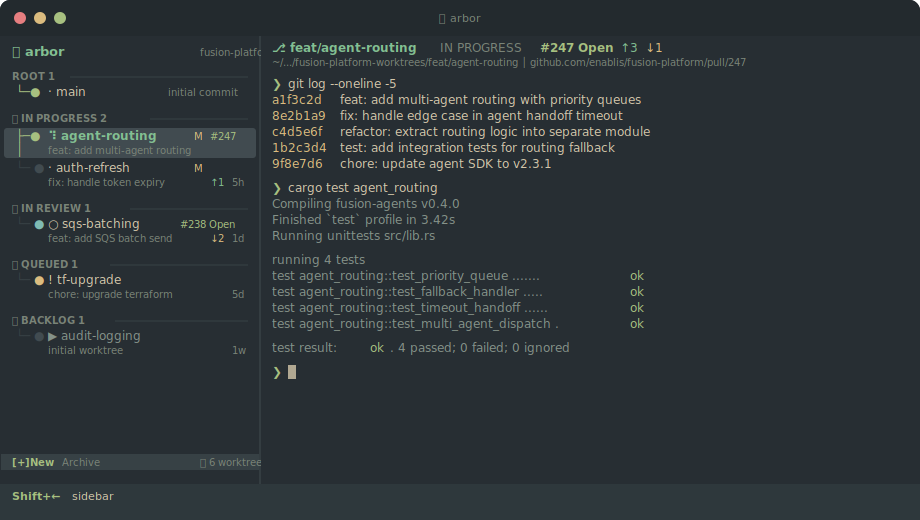

<p align="center">
  <br>
  
  <br><br>
  <strong>arbor</strong>
  <br>
  <em>grow your branches, tend your worktrees</em>
  <br><br>
  <a href="#install">Install</a> &middot;
  <a href="#the-lifecycle">Lifecycle</a> &middot;
  <a href="#keybindings">Keys</a> &middot;
  <a href="#multi-repo">Multi-Repo</a>
  <br><br>
</p>

---

<p align="center">
  
</p>

**arbor** is a TUI git worktree manager with an embedded terminal per branch. A split-pane interface with your worktree list on the left and a full shell session on the right. Create, switch, archive, and filter worktrees without ever leaving the terminal.

Branches are the heart of how we work. Arbor treats them like living things.

## The Lifecycle

Every worktree follows the lifecycle of a tree. Status is computed automatically from what's actually happening — no manual tracking.

```
  seed         seedling       tree           log
   🫘    --->    🌱    --->    🌳    --->    🪵
 BACKLOG       QUEUED     IN PROGRESS    IN REVIEW
 no terminal   shell idle  shell active   open PR
```

| Stage | What it means | How it happens |
|-------|---------------|----------------|
| 🫘 **Backlog** | Planted but dormant. Not yet started. | No terminal session exists |
| 🌱 **Queued** | Sprouting. Terminal open, waiting for you. | Terminal exists but idle |
| 🌳 **In Progress** | Growing. Actively running commands. | Terminal has recent output |
| 🪵 **In Review** | Harvested. Out for review. | Open or draft PR detected via `gh` |
| 🌲 **Root** | The trunk. Your main branch. Always at the top. | `main`/`master` worktree |

Press **`s`** to park any branch back to Backlog. Press again to unpark and let the lifecycle take over.

When you're done with a branch, cycle past In Progress and it offers to **archive** — the worktree directory is removed but the branch is kept. Restore archived branches any time through the create dialog.

## Install

```bash
cargo install --path .
```

Then run from any git repo:

```bash
arbor                          # current directory
arbor --repo /path/to/repo     # specific repo
arbor --worktree feature-auth  # jump to a branch
```

## Keybindings

Arbor has two panes. **Shift+Arrow** switches between them.

### Sidebar

| Key | Action |
|-----|--------|
| **`j`** / **`k`** or **`Up`** / **`Down`** | Navigate |
| **`Enter`** | Open terminal for branch |
| **`n`** | New worktree |
| **`a`** | Archive (remove worktree, keep branch) |
| **`s`** | Park / unpark to backlog |
| **`/`** | Filter by name |
| **`Ctrl+G`** | Open PR in browser |
| **`q`** | Quit |

### Terminal

All keystrokes go directly to your shell. **Shift+Left** to get back to the sidebar.

Text selection works normally with your mouse — arbor disables mouse capture when the terminal pane is focused.

## Multi-Repo

Point arbor at a parent directory and it discovers all git repos inside (up to 3 levels deep). Worktrees are prefixed with their repo name:

```
🌲 ROOT
  · platform/main
  · dashboard/main

🌳 IN PROGRESS
  ⠹ platform/agent-routing
  · dashboard/nav-redesign
```

Create new worktrees in any repo via the repo picker in the create dialog.

## Theme

Arbor wears the [Everforest](https://github.com/sainnhe/everforest) palette — warm greens and earth tones that feel right at home in the terminal.

The sidebar renders a tree structure with box-drawing characters: trunk lines connect branches in each group, with coloured leaf nodes at each fork.

**Truecolor** terminals (iTerm2, Alacritty, Kitty, WezTerm) get the full 24-bit RGB palette. Basic terminals automatically fall back to a 256-colour approximation.

## Architecture

Single-threaded event loop built on [ratatui](https://ratatui.rs) + [crossterm](https://docs.rs/crossterm). Git operations via [git2](https://docs.rs/git2) (libgit2 bindings, no shelling out). Terminal emulation via [portable-pty](https://docs.rs/portable-pty) + [vt100-ctt](https://docs.rs/vt100-ctt). PR detection via `gh` CLI in a background thread.

## Requirements

- Rust toolchain
- Git
- [`gh`](https://cli.github.com) CLI (optional — enables PR detection and In Review status)
- A truecolor terminal for best appearance

## License

MIT

---

<p align="center">
  <em>arbor</em> &mdash; latin for tree
</p>
